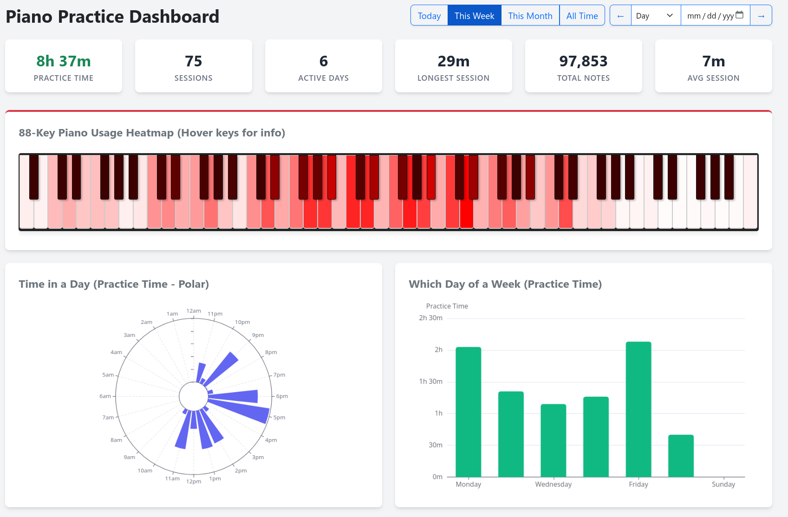

# Pianoteq Practice Tracker 🎹

A Python-based tracker that crawls through MIDI files generated by [Pianoteq](https://www.modartt.com/pianoteq) and creates a rich, interactive HTML dashboard visualizing your piano practice habits.

> ⚠️ **Disclaimer:** This project was 100% generated by AI.

## Features

- **Quick Stats & Custom Date Selection**: View your playtime metrics for Today, This Week, This Month, All Time, or any custom chosen calendar Day/Week. Use the left/right arrow buttons to quickly scroll back and forth through time!
- **88-Key Interactive Heatmap**: Parses raw keystroke data (`note_on` velocity events) inside the MIDI files to visually map out exactly which piano keys you hit the most on any given day.
- **GitHub-Style Contribution Calendars**: A heatmap grid showcasing your Practice Time per day over the last year.
- **Punchcards & Polar Charts**: Deep historical insights mapping out the exact times of day and days of the week you practice most frequently.



## Setup & Usage

### 1. Prerequisites
Ensure you have Python 3 installed. This script relies on the `mido` package to parse the MIDI files.

```bash
# Create a virtual environment and install requirements
python3 -m venv .venv
source .venv/bin/activate
pip install -r requirements.txt
```

### 2. Run the Tracker
Simply place the script at the root of the directory where Pianoteq saves your MIDI files (it will recursively search through subfolders).

```bash
python3 tracker.py
```

This command will output a standalone `index.html` file into the current directory.

Most commonly, Pianoteq stores archived sessions in your home directory:

```bash
python3 tracker.py -i ~/.local/share/Modartt/Pianoteq/Archive
```

### 3. View the Dashboard
Because the output is entirely self-contained HTML and JavaScript, you can simply open the `index.html` file in your browser to view the interactive dashboard. No server is required!

```bash
# Optional: if you want to start a quick local server
python3 -m http.server 8000
```
Then visit `http://localhost:8000` in your web browser.